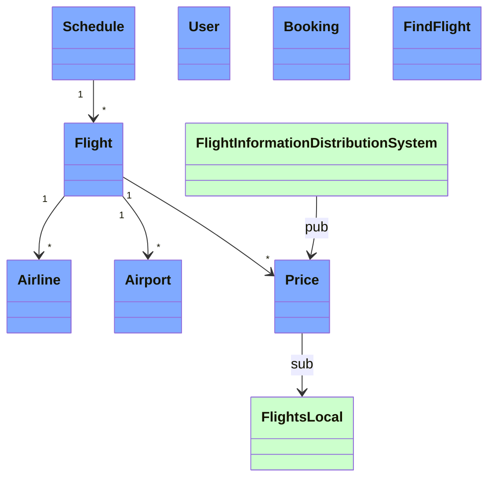

## FlightsLocal

```mermaid

classDiagram
%% Entities
    class Airline {
    }
    class Airport {
    }
    class Flight {
    }
    class Schedule {
    }
    class Price {
    }
    class User {
    }
    class Booking {
    }
%% Messages
    class FindFlight {
    }
    class FlightsLocal {
    }
    class FlightInformationDistributionSystem {
    }
%% Relationships

    Flight "1" --> "*" Airline
    Flight "1" --> "*" Airport
    Flight "1" --> "*" Price
    Schedule "1" --> "*" Flight
    
    Price --> FlightsLocal: sub
    FlightInformationDistributionSystem --> Price: pub
    
    style Airline fill: #80aaff
    style Airport fill: #80aaff
    style Flight fill: #80aaff
    style Schedule fill: #80aaff
    style Price fill: #80aaff
    style User fill: #80aaff
    style Booking fill: #80aaff

    style FindFlight fill: #80aaff

    style FlightsLocal fill: #ccffcc
    style FlightInformationDistributionSystem fill: #ccffcc

```
